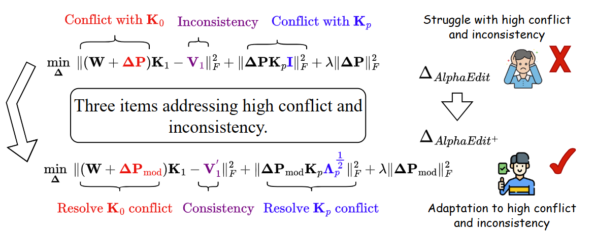

# AlphaEdit<sup>+</sup>: Model Editing in the Presence of Conflicting and Inconsistent Knowledge

**AlphaEdit<sup>+</sup>** is an enhanced knowledge editing method built upon the original AlphaEdit framework, which minimizes disruption to preserved knowledge by projecting parameter perturbations onto the null space of key matrices. While AlphaEdit effectively balances knowledge update and preservation under typical conditions, it struggles when faced with high knowledge conflicts (between new, preserved, and previously edited facts) and severe inconsistencies (where target values diverge significantly from the model's current beliefs).


## Core Innovations of AlphaEdit<sup>+</sup>

- **Adaptive Null-Space Relaxation:** A learnable perturbation matrix is introduced to relax the rigid null-space constraints, allowing more flexible updates when new knowledge conflicts with preserved knowledge.
- **Conflict-Aware Weighting:** A weighting scheme on prior-edit constraints reduces interference from historical edits that conflict with new updates.
- **Progressive Target Smoothing:** A smoothing strategy gradually adjusts the target values for highly inconsistent edits, enabling stable and incremental parameter updates.


These improvements enable AlphaEdit<sup>+</sup> to maintain high editing accuracy and generalization even in challenging scenarios, while preserving the model's general capabilities and hidden representation stability.





## Requirements

**Minimum Hardware Requirements:**
- At least one A100 80G GPU

**Software Dependencies:**
```bash
torch==2.6.0
einops==0.8.1
higher==0.2.1
hydra-core==1.3.2
transformers==4.51.3
datasets==2.21.0
matplotlib==3.10.3
spacy==3.4.1
scipy==1.15.2
scikit-learn==1.6.1
nltk==3.9.1
```

## AlphaSet Dataset

**AlphaSet** is a curated benchmark dataset designed to evaluate model editing algorithms under scenarios involving conflicting and inconsistent knowledge.  It encompasses a diverse range of editing cases with varying degrees of knowledge conflict and inconsistency, effectively simulating real-world situations encountered in model editing applications.

We provide a subset of AlphaSet in this repository for reproducibility and experimental validation.  You can find sample data and usage instructions in the `AlphaSet/` directory.


## Quick Start

### 1. Basic AlphaEdit<sup>+</sup> Usage

#### Edit GPT2-XL-1.5B with AlphaEdit<sup>+</sup> on ZsRE Dataset

```bash
python3 -m experiments.evaluate \
    --alg_name=AlphaEdit_plus \
    --model_name=../models/gpt2-xl \
    --hparams_fname=gpt2-xl.json \
    --ds_name=zsre \
    --dataset_size_limit=200 \
    --num_edits=100 \
    --downstream_eval_steps=1
```

#### Edit GPT-J-6B with AlphaEdit<sup>+</sup> on ZsRE Dataset

```bash
python3 -m experiments.evaluate \
    --alg_name=AlphaEdit_plus \
    --model_name=../models/gpt-j-6B \
    --hparams_fname=EleutherAI_gpt-j-6B.json \
    --ds_name=zsre \
    --dataset_size_limit=200 \
    --num_edits=100 \
    --downstream_eval_steps=1
```


### 2. Understanding Results

Results are stored in structured format at `results/AlphaEdit_plus/run_<run_id>/`:

```
results/
└── AlphaEdit_plus/
    └── run_<timestamp>/
        ├── params.json          # Hyperparameters used
        ├── case_0.json         # First edit result
        ├── case_1.json         # Second edit result
        └── ...                 # Additional edits
```

### 3. Results Summary and Analysis

#### Summarize Results Across Multiple Runs

```bash
python experiments/summarize.py \
    --dir_name=AlphaEdit_plus \
    --runs=run_<run1>,run_<run2>,run_<run3>
```

